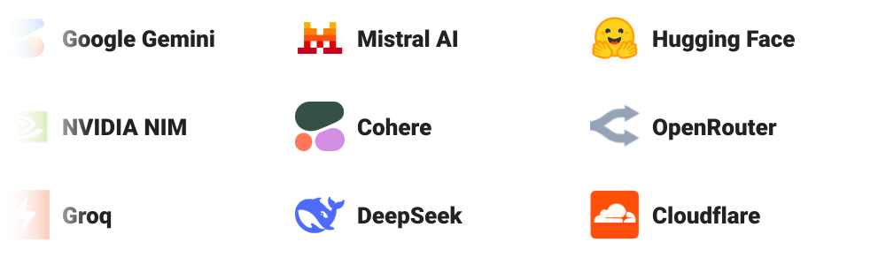

<p align="center">
  <h1 align="center">awesome-free-llm-apis</h1>
  <!-- AUTO_STATS -->
  <p align="center"><strong>167+ free LLM APIs from 25 providers</strong> — find, compare & configure free models in seconds.</p>
<!-- END_AUTO_STATS -->
</p>

<p align="center">
  <a href="https://freellms.org" target="_blank" rel="noopener"><strong>🌐 Live at freellms.org</strong></a> —
  <a href="https://freellms.org/models/" target="_blank" rel="noopener">Browse models</a> ·
  <a href="https://freellms.org/playground/" target="_blank" rel="noopener">Playground</a> ·
  <a href="https://freellms.org/config/" target="_blank" rel="noopener">Config generator</a> ·
  <a href="https://freellms.org/free-llm-api-keys/" target="_blank" rel="noopener">API keys</a>
</p>

<p align="center">
  
</p>

<!-- AUTO_UPDATE_BADGE -->
  <p align="center"><strong>🔄 Data refreshed daily from <a href="https://freellms.org" target="_blank" rel="noopener">freellms.org</a></strong> — Last updated: 2026-06-17</p>
<!-- END_AUTO_UPDATE_BADGE -->

<p align="center">
  🌐 <a href="README.md">English</a> · <a href="README.zh-CN.md">简体中文</a> · <a href="README.zh-TW.md">繁體中文</a> · <a href="README.ja.md">日本語</a> · <a href="README.ko.md">한국어</a>
</p>

---

## Why This Exists

Finding a free LLM API shouldn't mean hunting through a dozen GitHub READMEs, signing up for five different platforms, or guessing which models still have a free tier.

This repo is a **structured, machine-readable directory** of every free LLM API — rate limits, context windows, one-click config snippets, and direct API key links. Updated daily.

**Why this repo + <a href="https://freellms.org" target="_blank" rel="noopener">freellms.org</a>:**

- ✅ **Always up-to-date** — data refreshed daily via automated monitoring, not a 2-year-old static list
- ✅ **Credit card transparency** — clearly shows which providers require a card, phone verification, or nothing at all
- ✅ **One-click configs** — ready-to-copy snippets for Claude Code, Cursor, Codex, Aider, and 10+ more tools
- ✅ **Side-by-side comparison** — compare context windows, rate limits, and modalities across providers instantly

---

## How to Use — 3 Steps

1. **Pick a provider** — see [Provider Directory](#provider-directory) below. Start with **Groq** (no credit card, 30 RPM free).
2. **Get your API key** — click any [Get Key →](#quick-reference--base-urls--api-keys) link below, sign up (most need just an email), and copy your key. Takes < 1 minute.
3. **Plug it in** — copy the base URL + model ID, paste into the [Quick Start](#quick-start--use-any-free-api-in-30-seconds) examples below.

Configuring a specific tool? <a href="https://freellms.org/config/#claude-code" target="_blank" rel="noopener">Claude Code</a> · <a href="https://freellms.org/config/#cursor" target="_blank" rel="noopener">Cursor</a> · <a href="https://freellms.org/config/#codex" target="_blank" rel="noopener">Codex</a> · <a href="https://freellms.org/config/#openhuman" target="_blank" rel="noopener">OpenHuman</a> · <a href="https://freellms.org/config/#opencode" target="_blank" rel="noopener">OpenCode</a> · <a href="https://freellms.org/config/#openclaw" target="_blank" rel="noopener">OpenClaw</a> — one-click configs at <a href="https://freellms.org/config/" target="_blank" rel="noopener">freellms.org/config/</a>.


## Quick Start — Use Any Free API in 30 Seconds

**Never used an API before?** Here's the simplest path: go to <a href="https://console.groq.com/keys" target="_blank" rel="noopener">console.groq.com/keys</a>, sign up with just an email (no credit card), copy your free key, and paste it into any example below. You'll be running in under a minute.

All providers below expose an **OpenAI-compatible endpoint**. Any tool that accepts `baseURL` + `apiKey` works — just swap the base URL and key.

### Python (OpenAI SDK)

```python
from openai import OpenAI

client = OpenAI(
    base_url="https://api.groq.com/openai/v1",  # free, no credit card
    api_key="GROQ_API_KEY",                     # get at console.groq.com/keys
)

response = client.chat.completions.create(
    model="llama-3.3-70b-versatile",            # see Best Models table below
    messages=[{"role": "user", "content": "Hello!"}],
)
print(response.choices[0].message.content)
# Groq free tier: 30 RPM, 14,400 RPD — generous for personal use
```

### Codex CLI

```bash
export OPENAI_BASE_URL="https://api.groq.com/openai/v1"
export OPENAI_API_KEY="your-groq-key"          # get at console.groq.com/keys
codex --model "llama-3.3-70b-versatile"
```

### Cursor

```
Settings → Models → Add Model
  Model name: llama-3.3-70b-versatile
  Base URL: https://api.groq.com/openai/v1
  API key: your-groq-key                       # get at console.groq.com/keys
```

### Claude Code

```bash
# Claude Code needs an Anthropic-compatible API — use OpenRouter
export ANTHROPIC_BASE_URL="https://openrouter.ai/api"
export ANTHROPIC_AUTH_TOKEN="sk-or-v1-your-key"  # openrouter.ai/keys
export ANTHROPIC_API_KEY=""                       # must be empty
# Note: OpenRouter Anthropic models need $10 top-up (one-time)
```

### Using Other Tools?

Most AI dev tools accept custom API endpoints — just point them at any provider above. Grab your free key, then:

- **Claude Code** — set `ANTHROPIC_BASE_URL` + `ANTHROPIC_AUTH_TOKEN`. <a href="https://freellms.org/config/#claude-code" target="_blank" rel="noopener">Step-by-step →</a>
- **Cursor** — Settings → Models → Add Model. <a href="https://freellms.org/config/#cursor" target="_blank" rel="noopener">Step-by-step →</a>
- **Codex CLI** — set `OPENAI_BASE_URL` + `OPENAI_API_KEY`. <a href="https://freellms.org/config/#codex" target="_blank" rel="noopener">Step-by-step →</a>
- **OpenHuman** — edit `config.toml`. <a href="https://freellms.org/config/#openhuman" target="_blank" rel="noopener">Step-by-step →</a>
- **Aider** — edit `.aider.conf.yml`. <a href="https://freellms.org/config/#aider" target="_blank" rel="noopener">Step-by-step →</a>
- **Cline** (VS Code) — API provider settings. <a href="https://freellms.org/config/#cline" target="_blank" rel="noopener">Step-by-step →</a>
- **Open WebUI** — Settings → Connections. <a href="https://freellms.org/config/#open-webui" target="_blank" rel="noopener">Step-by-step →</a>

More ready-to-copy configs at <a href="https://freellms.org/config/" target="_blank" rel="noopener"><strong>freellms.org/config/</strong></a>.

> **All providers, base URLs, and API key links** are in the [Quick Reference](#quick-reference--base-urls--api-keys) below.


---

## Provider Directory

### ⚡ Permanent Free Tiers

These providers offer a **permanently free tier** — no credit card required for most.

<!-- BEGIN_PERMANENT_FREE -->
| Provider | Free Models | Credit Card? | Max Context | Modalities | Get API Key |
|---|---|---|---|---|---|
| NVIDIA NIM | 19 | Phone verification | 1M | image, text | <a href="https://build.nvidia.com/settings/api-keys" target="_blank" rel="noopener">→</a> |
| OVHcloud AI Endpoints | 12 | Registration | 262K | code, image, text | <a href="https://www.ovhcloud.com/en/public-cloud/ai-endpoints/catalog/" target="_blank" rel="noopener">→</a> |
| Cloudflare Workers AI | 11 | No | 10M | code, image, text | <a href="https://dash.cloudflare.com/profile/api-tokens" target="_blank" rel="noopener">→</a> |
| GitHub Models | 10 | No | 1M | text | <a href="https://github.com/marketplace/models" target="_blank" rel="noopener">→</a> |
| Groq | 9 | No | 262K | text | <a href="https://console.groq.com/keys" target="_blank" rel="noopener">→</a> |
| Mistral AI | 7 | No | 256K | code, image, text | <a href="https://console.mistral.ai/api-keys" target="_blank" rel="noopener">→</a> |
| Cohere | 6 | No | 256K | text | <a href="https://dashboard.cohere.com/api-keys" target="_blank" rel="noopener">→</a> |
| LLM7.io | 6 | No | 131K | code, text | <a href="https://token.llm7.io" target="_blank" rel="noopener">→</a> |
| Ollama Cloud | 6 | Registration | 262K | code, text | <a href="https://ollama.com/settings/keys" target="_blank" rel="noopener">→</a> |
| Aion Labs | 5 | Registration | 131K | text | <a href="https://www.aionlabs.ai" target="_blank" rel="noopener">→</a> |
| Google Gemini | 5 | No | 2M | text | <a href="https://aistudio.google.com/app/apikey" target="_blank" rel="noopener">→</a> |
| Cerebras | 5 | No | 131K | text | <a href="https://cloud.cerebras.ai/" target="_blank" rel="noopener">→</a> |
| Hugging Face | 5 | No | 131K | text | <a href="https://huggingface.co/settings/tokens" target="_blank" rel="noopener">→</a> |
| Kilo Code | 5 | No | 262K | code, text | <a href="https://kilo.ai" target="_blank" rel="noopener">→</a> |
| Alibaba Cloud Model Studio | 5 | Registration | 1M | code, image, text | <a href="https://bailian.console.alibabacloud.com/?apiKey=1" target="_blank" rel="noopener">→</a> |
| SambaNova | 4 | Registration | 128K | text | <a href="https://cloud.sambanova.ai/apis" target="_blank" rel="noopener">→</a> |
| Z AI (Zhipu AI) | 3 | No | 200K | text | <a href="https://open.bigmodel.cn/usercenter/apikeys" target="_blank" rel="noopener">→</a> |
| ModelScope | 3 | Registration | 131K | text | <a href="https://modelscope.cn/my/myaccesstoken" target="_blank" rel="noopener">→</a> |
| SiliconFlow | 3 | Registration | 131K | text | <a href="https://cloud.siliconflow.cn/account/ak" target="_blank" rel="noopener">→</a> |
| xAI | 3 | Registration | 2M | text | <a href="https://console.x.ai" target="_blank" rel="noopener">→</a> |
| AI21 Labs | 2 | Registration | 256K | text | <a href="https://studio.ai21.com/account/api-key" target="_blank" rel="noopener">→</a> |
| DeepSeek | 2 | Registration | 128K | text | <a href="https://platform.deepseek.com/api_keys" target="_blank" rel="noopener">→</a> |
| Nscale | 2 | Registration | 128K | text | <a href="https://console.nscale.com/" target="_blank" rel="noopener">→</a> |
| Nebius | 1 | Registration | 128K | text | <a href="https://studio.nebius.com/settings/api-keys" target="_blank" rel="noopener">→</a> |
<!-- END_PERMANENT_FREE -->

### 💰 Renewable Credits

Providers that periodically renew free credits.

<!-- BEGIN_RENEWABLE -->
| Provider | Free Models | Credit Model | Max Context | Modalities | Get API Key |
|---|---|---|---|---|---|
| OpenRouter | 28 | Free tier + $10 topup → 1K RPD | 1M | audio, code, embeddings, image, reasoning, rerank, text | <a href="https://openrouter.ai/workspaces/default/keys" target="_blank" rel="noopener">→</a> |
<!-- END_RENEWABLE -->

## Quick Reference — Base URLs & API Keys

<!-- BEGIN_QUICK_REF -->
| Provider | Base URL | Get API Key | Credit Card? |
|---|---|---|---|
| OpenRouter | `https://openrouter.ai/api/v1` | <a href="https://openrouter.ai/workspaces/default/keys" target="_blank" rel="noopener">Get Key →</a> | Registration |
| NVIDIA NIM | `https://integrate.api.nvidia.com/v1` | <a href="https://build.nvidia.com/settings/api-keys" target="_blank" rel="noopener">Get Key →</a> | Phone verification |
| OVHcloud AI Endpoints | `https://oai.endpoints.kepler.ai.cloud.ovh.net/v1` | <a href="https://www.ovhcloud.com/en/public-cloud/ai-endpoints/catalog/" target="_blank" rel="noopener">Get Key →</a> | Registration |
| Cloudflare Workers AI | `https://api.cloudflare.com/client/v4/accounts/{account_id}/ai/run` | <a href="https://dash.cloudflare.com/profile/api-tokens" target="_blank" rel="noopener">Get Key →</a> | No |
| GitHub Models | `https://models.github.ai/inference` | <a href="https://github.com/marketplace/models" target="_blank" rel="noopener">Get Key →</a> | No |
| Groq | `https://api.groq.com/openai/v1` | <a href="https://console.groq.com/keys" target="_blank" rel="noopener">Get Key →</a> | No |
| Mistral AI | `https://api.mistral.ai/v1` | <a href="https://console.mistral.ai/api-keys" target="_blank" rel="noopener">Get Key →</a> | No |
| Cohere | `https://api.cohere.com/v2` | <a href="https://dashboard.cohere.com/api-keys" target="_blank" rel="noopener">Get Key →</a> | No |
| LLM7.io | `https://api.llm7.io/v1` | <a href="https://token.llm7.io" target="_blank" rel="noopener">Get Key →</a> | No |
| Ollama Cloud | `https://api.ollama.com` | <a href="https://ollama.com/settings/keys" target="_blank" rel="noopener">Get Key →</a> | Registration |
| Aion Labs | `https://api.aionlabs.ai/v1` | <a href="https://www.aionlabs.ai" target="_blank" rel="noopener">Get Key →</a> | Registration |
| Google Gemini | `https://generativelanguage.googleapis.com/v1beta` | <a href="https://aistudio.google.com/app/apikey" target="_blank" rel="noopener">Get Key →</a> | No |
| Cerebras | `https://api.cerebras.ai/v1` | <a href="https://cloud.cerebras.ai/" target="_blank" rel="noopener">Get Key →</a> | No |
| Hugging Face | `https://router.huggingface.co/v1` | <a href="https://huggingface.co/settings/tokens" target="_blank" rel="noopener">Get Key →</a> | No |
| Kilo Code | `https://api.kilo.ai/api/gateway` | <a href="https://kilo.ai" target="_blank" rel="noopener">Get Key →</a> | No |
| Alibaba Cloud Model Studio | `https://dashscope-intl.aliyuncs.com/compatible-mode/v1` | <a href="https://bailian.console.alibabacloud.com/?apiKey=1" target="_blank" rel="noopener">Get Key →</a> | Registration |
| SambaNova | `https://api.sambanova.ai/v1` | <a href="https://cloud.sambanova.ai/apis" target="_blank" rel="noopener">Get Key →</a> | Registration |
| Z AI (Zhipu AI) | `https://open.bigmodel.cn/api/paas/v4` | <a href="https://open.bigmodel.cn/usercenter/apikeys" target="_blank" rel="noopener">Get Key →</a> | No |
| ModelScope | `https://api-inference.modelscope.cn/v1` | <a href="https://modelscope.cn/my/myaccesstoken" target="_blank" rel="noopener">Get Key →</a> | Registration |
| SiliconFlow | `https://api.siliconflow.cn/v1` | <a href="https://cloud.siliconflow.cn/account/ak" target="_blank" rel="noopener">Get Key →</a> | Registration |
| xAI | `https://api.x.ai/v1` | <a href="https://console.x.ai" target="_blank" rel="noopener">Get Key →</a> | Registration |
| AI21 Labs | `https://api.ai21.com/studio/v1` | <a href="https://studio.ai21.com/account/api-key" target="_blank" rel="noopener">Get Key →</a> | Registration |
| DeepSeek | `https://api.deepseek.com/v1` | <a href="https://platform.deepseek.com/api_keys" target="_blank" rel="noopener">Get Key →</a> | Registration |
| Nscale | `https://inference.api.nscale.com/v1` | <a href="https://console.nscale.com/" target="_blank" rel="noopener">Get Key →</a> | Registration |
| Nebius | `https://api.studio.nebius.com/v1` | <a href="https://studio.nebius.com/settings/api-keys" target="_blank" rel="noopener">Get Key →</a> | Registration |
<!-- END_QUICK_REF -->

## Best Free Models by Provider

<!-- BEGIN_BEST_MODELS -->
| Provider | Best Free Model | Model ID | Max Context | Rate Limit |
|---|---|---|---|---|
| OpenRouter | <a href="https://freellms.org/models/openrouter/openrouter-owl-alpha/" target="_blank" rel="noopener">Owl Alpha</a> | `openrouter/owl-alpha` | 1M | See provider |
|  | <a href="https://freellms.org/models/openrouter/nvidia-nemotron-3-ultra-550b-a55b/" target="_blank" rel="noopener">NVIDIA: Nemotron 3 Ultra (free)</a> | `nvidia/nemotron-3-ultra-550b-a55b:free` | 1M | See provider |
|  | <a href="https://freellms.org/models/openrouter/nex-agi-nex-n2-pro/" target="_blank" rel="noopener">Nex AGI: Nex-N2-Pro (free)</a> | `nex-agi/nex-n2-pro:free` | 262K | See provider |
| NVIDIA NIM | <a href="https://freellms.org/models/nvidia-nim/z-ai-glm-5-1/" target="_blank" rel="noopener">z-ai/glm-5.1</a> | `z-ai/glm-5.1` | 131K | Up to 40 RPM |
|  | <a href="https://freellms.org/models/nvidia-nim/qwen-qwen3-5-397b-a17b/" target="_blank" rel="noopener">qwen/qwen3.5-397b-a17b</a> | `qwen/qwen3.5-397b-a17b` | 256K | Up to 40 RPM |
|  | <a href="https://freellms.org/models/nvidia-nim/qwen-qwen3-5-122b-a10b/" target="_blank" rel="noopener">qwen/qwen3.5-122b-a10b</a> | `qwen/qwen3.5-122b-a10b` | 262K | Up to 40 RPM |
| OVHcloud AI Endpoints | <a href="https://freellms.org/models/ovhcloud-ai-endpoints/qwen3-5-397b-a17b/" target="_blank" rel="noopener">Qwen3.5-397B-A17B</a> | `qwen3-5-397b-a17b` | 131K | 2 RPM (anonymous) |
|  | <a href="https://freellms.org/models/ovhcloud-ai-endpoints/gpt-oss-20b/" target="_blank" rel="noopener">gpt-oss-20b</a> | `gpt-oss-20b` | 128K | 2 RPM (anonymous) |
|  | <a href="https://freellms.org/models/ovhcloud-ai-endpoints/meta-llama-3-3-70b-instruct/" target="_blank" rel="noopener">Meta-Llama-3_3-70B-Instruct</a> | `meta-llama-3-3-70b-instruct` | 131K | 2 RPM (anonymous) |
| Cloudflare Workers AI | <a href="https://freellms.org/models/cloudflare-workers-ai/cf-meta-llama-3-3-70b-instruct-fp8-fast/" target="_blank" rel="noopener">@cf/meta/llama-3.3-70b-instruct-fp8-fast</a> | `cf-meta-llama-3-3-70b-instruct-fp8-fast` | 131K | 10K neurons/day (shared) |
|  | <a href="https://freellms.org/models/cloudflare-workers-ai/cf-meta-llama-4-scout-17b-16e-instruct/" target="_blank" rel="noopener">@cf/meta/llama-4-scout-17b-16e-instruct</a> | `cf-meta-llama-4-scout-17b-16e-instruct` | 10M | 10K neurons/day (shared) |
|  | <a href="https://freellms.org/models/cloudflare-workers-ai/cf-openai-gpt-oss-120b/" target="_blank" rel="noopener">@cf/openai/gpt-oss-120b</a> | `cf-openai-gpt-oss-120b` | 128K | 10K neurons/day (shared) |
| GitHub Models | <a href="https://freellms.org/models/github-models/gpt-5/" target="_blank" rel="noopener">gpt-5</a> | `gpt-5` | 200K | 10 RPM, 50 RPD |
|  | <a href="https://freellms.org/models/github-models/gpt-4-1/" target="_blank" rel="noopener">gpt-4.1</a> | `gpt-4-1` | 1M | 10 RPM, 50 RPD |
|  | <a href="https://freellms.org/models/github-models/gpt-4-1-mini/" target="_blank" rel="noopener">gpt-4.1-mini</a> | `gpt-4-1-mini` | 1M | 15 RPM, 150 RPD |
| Groq | <a href="https://freellms.org/models/groq/llama-3-3-70b-versatile/" target="_blank" rel="noopener">llama-3.3-70b-versatile</a> | `llama-3-3-70b-versatile` | 131K | 30 RPM, 1,000 RPD |
|  | <a href="https://freellms.org/models/groq/llama-3-1-8b-instant/" target="_blank" rel="noopener">llama-3.1-8b-instant</a> | `llama-3-1-8b-instant` | 131K | 30 RPM, 1,000 RPD |
|  | <a href="https://freellms.org/models/groq/llama-4-scout-17b-16e-instruct/" target="_blank" rel="noopener">llama-4-scout-17b-16e-instruct</a> | `llama-4-scout-17b-16e-instruct` | 131K | 30 RPM, 1,000 RPD |
| Mistral AI | <a href="https://freellms.org/models/mistral-ai/mistral-medium-3-5-128b/" target="_blank" rel="noopener">Mistral Medium 3.5 (128B)</a> | `mistral-medium-3-5-128b` | 256K | ~1 RPS, 500K TPM |
|  | <a href="https://freellms.org/models/mistral-ai/mistral-small-4/" target="_blank" rel="noopener">Mistral Small 4</a> | `mistral-small-4` | 256K | ~1 RPS, 500K TPM |
|  | <a href="https://freellms.org/models/mistral-ai/mistral-large-3/" target="_blank" rel="noopener">Mistral Large 3</a> | `mistral-large-3` | 256K | ~1 RPS, 500K TPM |
| Cohere | <a href="https://freellms.org/models/cohere/command-a-218b/" target="_blank" rel="noopener">Command A+ (218B)</a> | `command-a-218b` | 128K | 20 RPM |
|  | <a href="https://freellms.org/models/cohere/command-a-111b/" target="_blank" rel="noopener">Command A (111B)</a> | `command-a-111b` | 256K | 20 RPM |
|  | <a href="https://freellms.org/models/cohere/command-r/" target="_blank" rel="noopener">Command R+</a> | `command-r` | 128K | 20 RPM |
| LLM7.io | <a href="https://freellms.org/models/llm7-io/deepseek-r1-0528/" target="_blank" rel="noopener">deepseek-r1-0528</a> | `deepseek-r1-0528` | 131K | 30 RPM (120 with token) |
|  | <a href="https://freellms.org/models/llm7-io/deepseek-v3-0324/" target="_blank" rel="noopener">deepseek-v3-0324</a> | `deepseek-v3-0324` | 131K | 30 RPM (120 with token) |
|  | <a href="https://freellms.org/models/llm7-io/gemini-2-5-flash-lite/" target="_blank" rel="noopener">gemini-2.5-flash-lite</a> | `gemini-2-5-flash-lite` | 131K | 30 RPM (120 with token) |
| Ollama Cloud | <a href="https://freellms.org/models/ollama-cloud/gpt-oss-120b-cloud/" target="_blank" rel="noopener">gpt-oss:120b-cloud</a> | `gpt-oss-120b-cloud` | 128K | Session/weekly limits (.. |
|  | <a href="https://freellms.org/models/ollama-cloud/deepseek-v3-1-671b-cloud/" target="_blank" rel="noopener">deepseek-v3.1:671b-cloud</a> | `deepseek-v3-1-671b-cloud` | 128K | Session/weekly limits (.. |
|  | <a href="https://freellms.org/models/ollama-cloud/qwen3-coder-480b-cloud/" target="_blank" rel="noopener">qwen3-coder:480b-cloud</a> | `qwen3-coder-480b-cloud` | 128K | Session/weekly limits (.. |
| Aion Labs | <a href="https://freellms.org/models/aion-labs/aion-2-5/" target="_blank" rel="noopener">Aion 2.5</a> | `aion-2-5` | 128K | 15 RPM, 20K TPD |
|  | <a href="https://freellms.org/models/aion-labs/aion-2-0/" target="_blank" rel="noopener">Aion 2.0</a> | `aion-2-0` | 128K | 15 RPM, 20K TPD |
|  | <a href="https://freellms.org/models/aion-labs/aion-rp-1-0-8b/" target="_blank" rel="noopener">Aion-RP 1.0 (8B)</a> | `aion-rp-1-0-8b` | 32K | 15 RPM, 20K TPD |
| Google Gemini | <a href="https://freellms.org/models/google-gemini/gemini-3-5-flash/" target="_blank" rel="noopener">Gemini 3.5 Flash</a> | `gemini-3-5-flash` | 1M | 15 RPM, 1,500 RPD |
|  | <a href="https://freellms.org/models/google-gemini/gemini-3-1-flash-lite/" target="_blank" rel="noopener">Gemini 3.1 Flash-Lite</a> | `gemini-3-1-flash-lite` | 1M | 30 RPM, 1,500 RPD |
|  | <a href="https://freellms.org/models/google-gemini/gemini-2-5-flash/" target="_blank" rel="noopener">Gemini 2.5 Flash</a> | `gemini-2-5-flash` | 1M | 15 RPM, 1,500 RPD |
| Cerebras | <a href="https://freellms.org/models/cerebras/gpt-oss-120b/" target="_blank" rel="noopener">gpt-oss-120b</a> | `gpt-oss-120b` | 128K | 30 RPM, 14,400 RPD, 1M .. |
|  | <a href="https://freellms.org/models/cerebras/zai-glm-4-7/" target="_blank" rel="noopener">zai-glm-4.7</a> | `zai-glm-4-7` | 128K | 10 RPM, 100 RPD, 1M TPD |
|  | <a href="https://freellms.org/models/cerebras/llama-3-3-70b/" target="_blank" rel="noopener">llama-3.3-70b</a> | `llama-3-3-70b` | 128K | 30 RPM, 14,400 RPD, 1M .. |
| Hugging Face | <a href="https://freellms.org/models/hugging-face/meta-llama-3-1-8b-instruct/" target="_blank" rel="noopener">Meta-Llama-3.1-8B-Instruct</a> | `meta-llama-3-1-8b-instruct` | 128K | Credit-metered |
|  | <a href="https://freellms.org/models/hugging-face/mistral-7b-instruct-v0-3/" target="_blank" rel="noopener">Mistral-7B-Instruct-v0.3</a> | `mistral-7b-instruct-v0-3` | 32K | Credit-metered |
|  | <a href="https://freellms.org/models/hugging-face/mixtral-8x7b-instruct-v0-1/" target="_blank" rel="noopener">Mixtral-8x7B-Instruct-v0.1</a> | `mixtral-8x7b-instruct-v0-1` | 32K | Credit-metered |
| Kilo Code | <a href="https://freellms.org/models/kilo-code/x-ai-grok-code-fast-1-free/" target="_blank" rel="noopener">x-ai/grok-code-fast-1:free</a> | `x-ai-grok-code-fast-1-free` | 256K | ~200 req/hr |
|  | <a href="https://freellms.org/models/kilo-code/minimax-minimax-m2-5-free/" target="_blank" rel="noopener">minimax/minimax-m2.5:free</a> | `minimax-minimax-m2-5-free` | 196K | ~200 req/hr |
|  | <a href="https://freellms.org/models/kilo-code/bytedance-seed-dola-seed-2-0-pro-free/" target="_blank" rel="noopener">bytedance-seed/dola-seed-2.0-pro:free</a> | `bytedance-seed-dola-seed-2-0-pro-free` | 131K | ~200 req/hr |
| Alibaba Cloud Model Studio | <a href="https://freellms.org/models/alibaba-cloud-model-studio/qwen3-max/" target="_blank" rel="noopener">Qwen3-Max</a> | `qwen3-max` | 128K | Tiered by region |
|  | <a href="https://freellms.org/models/alibaba-cloud-model-studio/qwen3-plus/" target="_blank" rel="noopener">Qwen3-Plus</a> | `qwen3-plus` | 1M | Tiered by region |
|  | <a href="https://freellms.org/models/alibaba-cloud-model-studio/qwen3-vl-plus/" target="_blank" rel="noopener">Qwen3-VL-Plus</a> | `qwen3-vl-plus` | 128K | Tiered by region |
| SambaNova | <a href="https://freellms.org/models/sambanova/deepseek-v3-1/" target="_blank" rel="noopener">DeepSeek-V3.1</a> | `deepseek-v3-1` | 128K | 20 RPM, 20 RPD, 200K TPD |
|  | <a href="https://freellms.org/models/sambanova/deepseek-v3-2-preview/" target="_blank" rel="noopener">DeepSeek-V3.2 (Preview)</a> | `deepseek-v3-2-preview` | 128K | 20 RPM, 20 RPD, 200K TPD |
|  | <a href="https://freellms.org/models/sambanova/minimax-m2-7/" target="_blank" rel="noopener">MiniMax-M2.7</a> | `minimax-m2-7` | 128K | 20 RPM, 20 RPD, 200K TPD |
| Z AI (Zhipu AI) | <a href="https://freellms.org/models/z-ai-zhipu-ai/glm-4-7-flash/" target="_blank" rel="noopener">GLM-4.7-Flash</a> | `glm-4-7-flash` | 200K | 1 concurrent request |
|  | <a href="https://freellms.org/models/z-ai-zhipu-ai/glm-4-6v-flash/" target="_blank" rel="noopener">GLM-4.6V-Flash</a> | `glm-4-6v-flash` | 128K | 1 concurrent request |
|  | <a href="https://freellms.org/models/z-ai-zhipu-ai/glm-4-5-flash/" target="_blank" rel="noopener">GLM-4.5-Flash</a> | `glm-4-5-flash` | 128K | 1 concurrent request |
| ModelScope | <a href="https://freellms.org/models/modelscope/qwen-qwen3-5-35b-a3b/" target="_blank" rel="noopener">Qwen/Qwen3.5-35B-A3B</a> | `qwen-qwen3-5-35b-a3b` | 131K | 2,000 RPD total; <=500 .. |
|  | <a href="https://freellms.org/models/modelscope/qwen-qwen3-5-27b/" target="_blank" rel="noopener">Qwen/Qwen3.5-27B</a> | `qwen-qwen3-5-27b` | 131K | 2,000 RPD total; <=500 .. |
|  | <a href="https://freellms.org/models/modelscope/qwen-qwen-image/" target="_blank" rel="noopener">Qwen/Qwen-Image</a> | `qwen-qwen-image` | 131K | 2,000 RPD total; model/.. |
| SiliconFlow | <a href="https://freellms.org/models/siliconflow/deepseek-ai-deepseek-r1-distill-qwen-7b/" target="_blank" rel="noopener">deepseek-ai/DeepSeek-R1-Distill-Qwen-7B</a> | `deepseek-ai-deepseek-r1-distill-qwen-7b` | 131K | 30 RPM, 60K TPM |
|  | <a href="https://freellms.org/models/siliconflow/abbreviation/" target="_blank" rel="noopener">Abbreviation</a> | `abbreviation` | 131K | See provider |
|  | <a href="https://freellms.org/models/siliconflow/deepseek-ai-deepseek-ocr/" target="_blank" rel="noopener">deepseek-ai/DeepSeek-OCR</a> | `deepseek-ai-deepseek-ocr` | 131K | 30 RPM, 60K TPM |
| xAI | <a href="https://freellms.org/models/xai/grok-4-3/" target="_blank" rel="noopener">grok-4.3</a> | `grok-4-3` | 1M | Credit-based |
|  | <a href="https://freellms.org/models/xai/grok-4-1-fast/" target="_blank" rel="noopener">grok-4.1-fast</a> | `grok-4-1-fast` | 2M | Credit-based |
|  | <a href="https://freellms.org/models/xai/grok-3-mini/" target="_blank" rel="noopener">grok-3-mini</a> | `grok-3-mini` | 131K | Credit-based |
| AI21 Labs | <a href="https://freellms.org/models/ai21-labs/jamba-large-1-7/" target="_blank" rel="noopener">Jamba Large 1.7</a> | `jamba-large-1-7` | 256K | 200 RPM, 10 RPS |
|  | <a href="https://freellms.org/models/ai21-labs/jamba-mini-2/" target="_blank" rel="noopener">Jamba Mini 2</a> | `jamba-mini-2` | 256K | 200 RPM, 10 RPS |
| DeepSeek | <a href="https://freellms.org/models/deepseek/deepseek-chat-v3-2/" target="_blank" rel="noopener">deepseek-chat (V3.2)</a> | `deepseek-chat-v3-2` | 128K | Dynamic |
|  | <a href="https://freellms.org/models/deepseek/deepseek-reasoner-r1/" target="_blank" rel="noopener">deepseek-reasoner (R1)</a> | `deepseek-reasoner-r1` | 128K | Dynamic |
| Nscale | <a href="https://freellms.org/models/nscale/llama-3-3-70b-instruct/" target="_blank" rel="noopener">Llama-3.3-70B-Instruct</a> | `llama-3-3-70b-instruct` | 128K | Fair-use |
|  | <a href="https://freellms.org/models/nscale/deepseek-r1-distill-llama-70b/" target="_blank" rel="noopener">DeepSeek-R1-Distill-Llama-70B</a> | `deepseek-r1-distill-llama-70b` | 128K | Fair-use |
| Nebius | <a href="https://freellms.org/models/nebius/qwen3-235b-a22b/" target="_blank" rel="noopener">Qwen3-235B-A22B</a> | `qwen3-235b-a22b` | 128K | Tier-based |
<!-- END_BEST_MODELS -->


### 🖥️ Local / Self-Hosted (Unlimited, Private, Free Forever)

| Tool | Type | Highlights |
|---|---|---|
| <a href="https://ollama.com" target="_blank" rel="noopener">Ollama</a> | CLI + API | 100+ models, GPU acceleration, OpenAI-compatible endpoint |
| <a href="https://lmstudio.ai" target="_blank" rel="noopener">LM Studio</a> | Desktop GUI | Any GGUF model, built-in model browser, offline |
| <a href="https://github.com/ggerganov/llama.cpp" target="_blank" rel="noopener">llama.cpp</a> | C/C++ engine | Runs any GGUF, minimal dependencies |
| <a href="https://gpt4all.io" target="_blank" rel="noopener">GPT4All</a> | Desktop app | CPU-only, no GPU required, open source |
| <a href="https://jan.ai" target="_blank" rel="noopener">Jan.ai</a> | Desktop app | Privacy-focused, 100% offline ChatGPT alternative |
| <a href="https://github.com/LostRuins/koboldcpp" target="_blank" rel="noopener">KoboldCpp</a> | Single executable | Optimized for creative writing, GGUF |

---

## Top Free Models (by Weekly Usage)

Data from freellms.org, updated daily via API monitoring.

<!-- BEGIN_TOP_MODELS -->
| Model | Provider | Context | Weekly Usage |
|---|---|---|---|
| <a href="https://freellms.org/models/openrouter/openrouter-owl-alpha/" target="_blank" rel="noopener">Owl Alpha</a> | OpenRouter | 1M | 2446B tokens |
| <a href="https://freellms.org/models/openrouter/nvidia-nemotron-3-ultra-550b-a55b/" target="_blank" rel="noopener">NVIDIA: Nemotron 3 Ultra (free)</a> | OpenRouter | 1M | 776B tokens |
| <a href="https://freellms.org/models/nvidia-nim/z-ai-glm-5-1/" target="_blank" rel="noopener">z-ai/glm-5.1</a> | NVIDIA NIM | 131K | 706B tokens |
| <a href="https://freellms.org/models/openrouter/nex-agi-nex-n2-pro/" target="_blank" rel="noopener">Nex AGI: Nex-N2-Pro (free)</a> | OpenRouter | 262K | 674B tokens |
| <a href="https://freellms.org/models/openrouter/poolside-laguna-m.1/" target="_blank" rel="noopener">Poolside: Laguna M.1 (free)</a> | OpenRouter | 262K | 599B tokens |
| <a href="https://freellms.org/models/openrouter/nvidia-nemotron-3-super-120b-a12b/" target="_blank" rel="noopener">NVIDIA: Nemotron 3 Super (free)</a> | OpenRouter | 1M | 356B tokens |
| <a href="https://freellms.org/models/openrouter/openai-gpt-oss-120b/" target="_blank" rel="noopener">OpenAI: gpt-oss-120b (free)</a> | OpenRouter | 131K | 203B tokens |
| <a href="https://freellms.org/models/openrouter/poolside-laguna-xs.2/" target="_blank" rel="noopener">Poolside: Laguna XS.2 (free)</a> | OpenRouter | 262K | 95B tokens |
| <a href="https://freellms.org/models/openrouter/openai-gpt-oss-20b/" target="_blank" rel="noopener">OpenAI: gpt-oss-20b (free)</a> | OpenRouter | 131K | 57B tokens |
| <a href="https://freellms.org/models/openrouter/google-gemma-4-31b-it/" target="_blank" rel="noopener">Google: Gemma 4 31B (free)</a> | OpenRouter | 262K | 40B tokens |
<!-- END_TOP_MODELS -->

---

## Repository Structure

```
awesome-free-llm-apis/
├── README.md              ← Complete provider directory & code examples
├── code-examples/          ← Ready-to-use config snippets
│   ├── claude-code.md
│   ├── cursor.md
│   └── codex.md
└── LICENSE                 ← MIT
```

> For the full structured dataset with 453 models and daily updates, visit **<a href="https://freellms.org" target="_blank" rel="noopener">freellms.org</a>**.

---

## Contributing

We welcome contributions!

- **Add a missing free model** — Open an <a href="https://github.com/open-free-llm-api/awesome-free-llm-apis/issues" target="_blank" rel="noopener">issue</a> or submit a PR
- **Fix inaccurate data** — Rate limits change, providers graduate. PRs welcome
- **Add a config snippet** — Have a working config for a tool we don't cover? Add it to `code-examples/`

### Criteria for inclusion

A model belongs in this list if:
1. The provider explicitly offers a **free tier** (not just a trial credit)
2. The API is **publicly accessible** (no waitlist, closed beta, or reverse-engineering)
3. For trial credits: clearly labeled and minimum $1 credit value

---

## Links

- 🌐 **Live site**: <a href="https://freellms.org" target="_blank" rel="noopener">freellms.org</a> — search, compare, playground, config generator
- 🔑 **API key directory**: <a href="https://freellms.org/free-llm-api-keys/" target="_blank" rel="noopener">freellms.org/free-llm-api-keys/</a>
- ⚙️ **Config generator**: <a href="https://freellms.org/config/" target="_blank" rel="noopener">freellms.org/config/</a>
- 🎮 **Playground**: <a href="https://freellms.org/playground/" target="_blank" rel="noopener">freellms.org/playground/</a>
- 📊 **Compare models**: <a href="https://freellms.org/compare/" target="_blank" rel="noopener">freellms.org/compare/</a>

## License

MIT © <a href="https://github.com/open-free-llm-api" target="_blank" rel="noopener">open-free-llm-api</a>

---

<p align="center">
  <sub>Last updated: <!-- AUTO_LAST_UPDATED -->
2026-06-17
<!-- END_AUTO_LAST_UPDATED --></sub>
</p>
